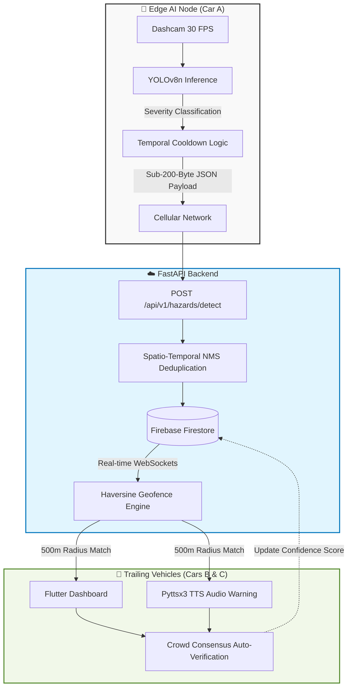

<div align="center">

# 🚨 <span style="color:#FF4B4B">RoadGuard</span> <span style="color:#00B4D8">AI</span> 🛡️

<a href="https://github.com/rehan12360/Roadguard-AI">
  
</a>

<br>

<p align="center">
  
  
  
  
  
  
</p>

### 🌍 Transforming every ordinary vehicle into an autonomous road safety sentinel.


</div>

<br>

## 📌 Problem Statement

> ⚠️ **The Critical Flaw in Modern Navigation** <br>
> Waze and Google Maps rely entirely on **manual, highly distracting, and delayed driver input**. Hazards are reported reactively, often miles behind their actual physical location. 

Potholes, sudden waterlogging, and road debris cause billions in vehicle damage and contribute to countless accidents annually. Our current data collection infrastructure remains dangerously slow, fundamentally manual, and incapable of providing the split-second, hyper-local awareness required to prevent accidents before they happen.

<br>

<div align="center">
  
</div>

<br>

## 💡 The Solution

RoadGuard AI fundamentally reimagines road safety by deploying a **hybrid Edge-to-Cloud architecture** that transforms every ordinary vehicle into an autonomous, mobile road inspection unit. 

<table>
  <tr>
    <td></td>
    <td><b>1. Edge AI Inference</b><br>We deploy a custom-trained YOLOv8n computer vision model directly to vehicle dashcams to detect hazards in real-time at 30 FPS.</td>
  </tr>
  <tr>
    <td></td>
    <td><b>2. Ultra-Light Payloads</b><br>Instead of streaming heavy, latency-prone video, the edge client processes frames locally and transmits a sub-200-byte JSON payload.</td>
  </tr>
  <tr>
    <td></td>
    <td><b>3. Spatio-Temporal WebSockets</b><br>The cloud instantly utilizes the Haversine spherical distance formula to push real-time WebSocket alerts strictly to trailing vehicles within a 500-meter geofence.</td>
  </tr>
</table>

<br>

<br>

## 🏗️ System Architecture

Our system utilizes a highly optimized Edge-to-Cloud pipeline to minimize latency and preserve bandwidth.



<br>

## 🧠 Core Algorithms

### 📡 1. Spatio-Temporal NMS (Non-Maximum Suppression)
Solves the "map flooding" problem. Edge AI detecting a pothole over 120 frames would normally spam a database. Our cloud backend mathematically clusters and deduplicates reports using strict temporal deltas (2.5s rolling windows) and Euclidean spatial distance tracking on normalized bounding boxes.

### 🤝 2. Crowd Consensus Verification
To combat Edge AI false positives (like misclassifying a shadow), we engineered a self-healing consensus algorithm. When trailing cars physically cross the exact GPS coordinates of a hazard, the system autonomously triggers a verification ping, escalating the confidence score (e.g., `0.92 -> 0.97 -> 0.99`).

### 🌐 3. Hyper-Targeted Haversine Geofencing
Alerts are restricted strictly to vehicles within a 500-meter radius, factoring in relative heading and lane positioning, utilizing the Haversine formula based on the Earth's radius:
> `Distance = 2 * R * atan2(√a, √(1-a))`

<br>

<br>

## 🚀 What You Will See in the Demo

| 🚘 Vehicle | 📍 Distance | 🔔 Alert Received? | 🤖 System Action |
|---------|----------|-----------------|---------------|
| **Car A** | Origin | N/A | Detects hazard & uploads JSON to cloud |
| **Car B** | 300m | ✅ **YES** | Triggers audio: Move right & reduce speed |
| **Car C** | 250m | ✅ **YES** | Triggers audio: Already in safe lane |
| **Car D** | 800m | ❌ **NO** | Outside 500m Haversine radius (ignored) |

As **Car B** and **Car C** drive over the coordinates, the confidence mathematically scales: **0.92 → 0.97 → 0.99**.

<br>

## ⚙️ How To Run (Local Demo)

<details>
<summary><b>Click to reveal setup instructions</b></summary>
<br>

### Step 1 — Start the Backend
```bash
cd cloud_backend
# Activate environment (e.g., env_cloud\Scripts\activate)
uvicorn main:app --reload --host 0.0.0.0 --port 8000
```

### Step 2 — Start Car A (Detection Engine)
```bash
cd core_engine
# Activate environment
python vision.py
```

### Step 3 — Run Flutter App on Phone
```bash
cd flutter_app
flutter run
```
</details>

<br>

<div align="center">
  
  <p><i>Built for the Future of Smart Cities and V2X Communication.</i></p>
</div>