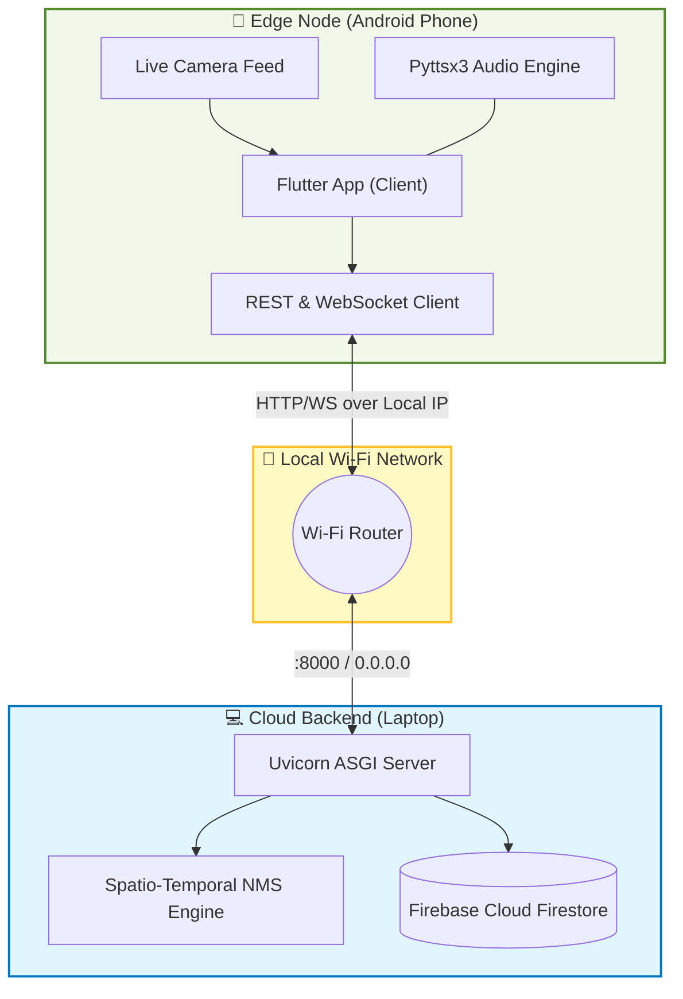
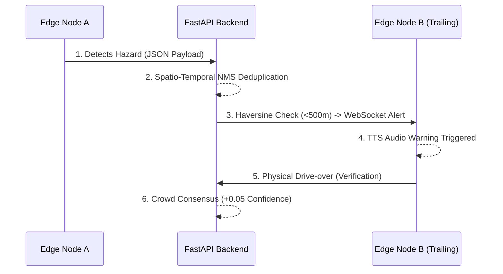

# 🛡️ RoadGuard AI — Comprehensive Phone & Pitch Demo Setup Guide

This guide provides step-by-step instructions for deploying the **RoadGuard AI Edge-to-Cloud architecture** locally. It covers running the FastAPI cloud engine on your local machine and connecting physical mobile edge nodes (phones) to simulate our Spatio-Temporal Geofencing algorithms.

---

## 🏗️ Deployment Architecture Topology

Before setting up, understand how the system components communicate over your Local Area Network (LAN) during the demo:



---

## 📋 Prerequisites Checklist

Ensure your development environment meets the following specifications:
- [x] **Flutter SDK** (v3.0.0+) with Android SDK tools configured.
- [x] **Python** (v3.9+) for backend API and spatial algorithms.
- [x] **Android Mobile Phone** (Developer Mode & USB Debugging enabled) OR Android Emulator.
- [x] **Network:** Laptop and Phone connected to the **SAME Wi-Fi network** (No AP Isolation).

---

## 🌐 Step 1: Network Configuration (Local IP Binding)

To allow the Edge Nodes (phones) to stream JSON metadata to the Cloud Backend (laptop), you must configure the local IP bridge:

1. Open a terminal / command prompt on your laptop:
   - **Windows**: Run `ipconfig` -> Note the **IPv4 Address** (e.g., `192.168.1.42`).
   - **Mac/Linux**: Run `ifconfig` or `ip addr` -> Note the `inet 192.168.x.x` address.

2. Open `flutter_app/lib/services/api_service.dart` in your code editor.
3. Update the `baseUrl` constant with your laptop's IP address to map API requests correctly:
   ```dart
   // Example:
   static const String baseUrl = 'http://192.168.1.42:8000';
   ```

---

## 🐍 Step 2: Initialize the Cloud Backend

This step spins up the FastAPI microservice that handles Spatio-Temporal NMS deduplication and Haversine spatial calculations.

1. Open terminal on your laptop and navigate to the backend service:
   ```bash
   cd f:\roadguard-prototype\cloud_backend
   ```
2. Activate your Python virtual environment (if using one):
   ```bash
   .\env_cloud\Scripts\activate
   ```
3. Install strict dependencies:
   ```bash
   pip install -r requirements.txt
   ```
4. Launch the Uvicorn ASGI server bound to `--host 0.0.0.0` (critical for exposing the port to the LAN):
   ```bash
   uvicorn main:app --reload --host 0.0.0.0 --port 8000
   ```
   > 🟢 **Verification**: You should see: `INFO: Uvicorn running on http://0.0.0.0:8000`

---

## 📱 Step 3: Edge Client (Flutter) Compilation

1. Open a second terminal window and navigate to the client codebase:
   ```bash
   cd f:\roadguard-prototype\flutter_app
   ```
2. Fetch dependencies (including `google_maps_flutter` and `flutter_tts`):
   ```bash
   flutter pub get
   ```
3. Verify Android hardware permissions in `flutter_app/android/app/src/main/AndroidManifest.xml`:
   ```xml
   <uses-permission android:name="android.permission.INTERNET"/>
   <uses-permission android:name="android.permission.ACCESS_FINE_LOCATION"/>
   <uses-permission android:name="android.permission.READ_EXTERNAL_STORAGE"/>
   ```

---

## 📲 Step 4: Flash Firmware to Edge Device

1. Connect your Android phone to your laptop via USB.
2. Verify Flutter detects the hardware target:
   ```bash
   flutter devices
   ```
3. Compile and launch the app directly on the edge node:
   ```bash
   flutter run -d <your-device-id>
   ```

*(Optional Release APK)*: To generate an untethered, optimized build:
```bash
flutter build apk --release
```

---

## 🚀 Step 5: Live System Demonstration Flow

Follow this exact sequence to demonstrate the autonomous nature and Crowd Consensus algorithms to the AI/Human judges:



### 1️⃣ Step 5.1 — Autonomous Edge Detection (Car A)
1. In the app, select **Car A — AI Detection Car**, then tap **START VIDEO AI SCANNER**.
2. Tap **DEMO CLIP** to simulate a real-world dashcam feed.
3. Watch the YOLOv8 engine flag bounding boxes in real-time. Notice that only a lightweight JSON payload is sent to the cloud, preventing API spam.

### 2️⃣ Step 5.2 — Spatial Radar Geofencing
1. Tap the **Radar Map** tab.
2. Observe the strict **red 500m geofence** calculated dynamically via the Haversine formula centered on Car A's detection.

### 3️⃣ Step 5.3 — Low-Latency Alert & Verification (Car B)
1. Select **Car B — Driver (250m Ahead)** from the Setup tab.
2. The Pyttsx3 TTS engine will autonomously announce: *"Warning! Pothole detected 250 meters ahead!"*
3. Tap **VERIFY HAZARD** to demonstrate the **Crowd Consensus** algorithm updating the global confidence score in real-time.

### 4️⃣ Step 5.4 — Haversine Radius Culling (Car D)
1. Select **Car D — Driver (850m Out)**.
2. Observe that no alert is received. This proves the backend successfully mathematically filters irrelevant targets to prevent alert fatigue.

---

## 🛠️ Troubleshooting & Diagnostics

| Issue | Technical Solution |
| :--- | :--- |
| **Backend Unreachable (Timeout)** | Ensure AP Isolation is disabled on the router. Verify laptop IPv4 in `api_service.dart`. Check Windows Defender Firewall (allow TCP port 8000). |
| **Google Maps Grid is Blank** | Missing Google Maps API key in `AndroidManifest.xml` metadata. |
| **No Edge Audio Output** | Ensure TTS engine is installed at OS level. Verify media stream volume is active. |
